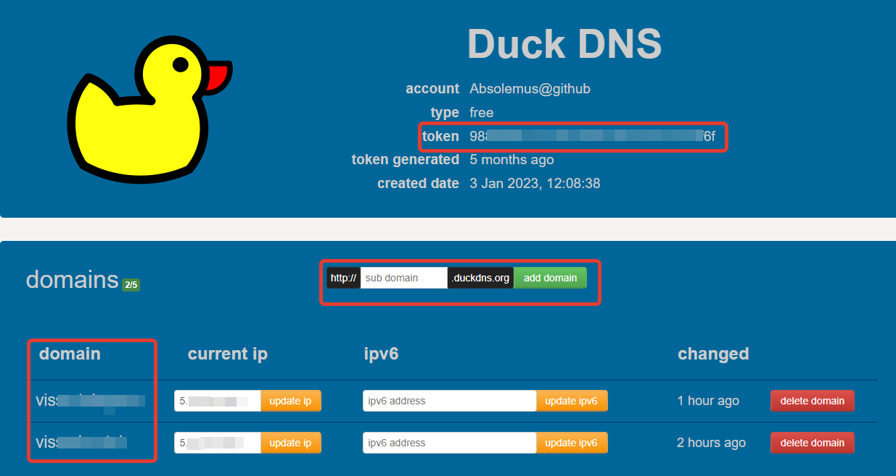

# nginx_reverse_proxy

[Обратный](https://yandex.kz/search/?text=обратный+прокси+сервер&lr=162&clid=2378387-1&win=571&src=suggest_T) прокси-сервер, с [TLS](https://yandex.kz/search/?text=Что+такое+TLS&lr=162&clid=2378387-1&win=571) протоколом, в связке с [DDNS DuckDNS.org](https://www.duckdns.org/), автоматическим созданием сертификтов [Let's Encrypt](https://letsencrypt.org/) и подтверждением владения доменом, используя проверку [ACME challenge](https://habr.com/ru/articles/350202/) и все это в [контейнерах](https://www.docker.com/).

А теперь по порядку

## Динамический DNS

Для того, чтобы из интернета вызвать службу, находящуюся в вашей локальной сети, вам нужен белый IP. Если не хочется платить за такую услугу, или по какой-либо другой причине нет возможности получить вожделенный белый IP адрес, можно воспользоваться услугой Dynamic DNS. Поставщиков на рынке немало, есть платные, условно-бесплатные и бесплатные поставщики. Мой выбор пал на [DuckDNS.org](https://www.duckdns.org/). Это полностью бесплатный DDNS, с простой регистрацией и элементарной настройкой.

Все, что вам нужно, это пройти на сайт DuckDNS.org, авторизоваться любым удобным для вас способом и создать свое доменное имя. Вам присвоется личный токен, который необходим для использования сервиса.



**Также этот сервис поддерживает TXT запись для ACME challenge, чтобы вы могли подтвердить удостоверябщему центру, что именно вы владеете этим доменом. Все это нужно для получения сертификатов.**

Единственный момент, что сервису DDNS необходимо периодически указывать свой актуальный IP адрес. Как это сделать в случае с данным сервисом, можно почитать [тут](https://www.duckdns.org/install.jsp) либо периодически отправлять запрос с шаблоном `https://www.duckdns.org/update?domains={YOURVALUE}&token={YOURVALUE}[&ip={YOURVALUE}]`

## Обратный прокси

Веб-сервер nginx, который расшифровывает входящий трафик и перенаправляет его на внутренние порты в локальной сети.

### Конфигурация

```nginxconf
events {}
http {

# если трафик приходит по протоколу HTTP на порт 80, мы перенаправляем его на HTTPS
# вместо "domain" необходимо подставить свой домен в системе DuckDNS
# в этой настройке порт 80 - это порт самого контейнера, менять его надо только в том случае, если он был изменен в docker-compose файле
  server {
    listen 80;
    location / {
      return 301 https://domain.duckdns.org$request_uri;
    }
  }

  server {
    # точно также, порт 443 - это внутренний порт контейнера. При изменении в docker-compose файле, меняем значение и здесь
    listen 443 ssl http2;

    # указываем месторасположение сертификатов. Не рекомендуется менять путь, вам нужно лишь заменить "domain" на ваш домен в системе DuckDNS
    ssl_certificate /etc/letsencrypt/live/domain.duckdns.org/fullchain.pem;
    ssl_certificate_key /etc/letsencrypt/live/domain.duckdns.org/privkey.pem;

    # некоторые рекомендуемые настройки для веб-сервера с TLS протоколом
    ssl_session_cache shared:le_nginx_SSL:10m;
    ssl_session_timeout 1440m;
    ssl_session_tickets off;
    ssl_protocols TLSv1.2 TLSv1.3;
    ssl_prefer_server_ciphers off;
    ssl_ciphers "ECDHE-ECDSA-AES128-GCM-SHA256:ECDHE-RSA-AES128-GCM-SHA256:ECDHE-ECDSA-AES256-GCM-SHA384:ECDHE-RSA-AES256-GCM-SHA384:ECDHE-ECDSA-CHACHA20-POLY1305:ECDHE-RSA-CHACHA20-POLY1305:DHE-RSA-AES128-GCM-SHA256:DHE-RSA-AES256-GCM-SHA384";
    ssl_dhparam /etc/letsencrypt/ssl-dhparams.pem;

     location / {
      add_header Cache-Control "public, must-revalidate";
      add_header Front-End-Https on;
      add_header Strict-Transport-Security "max-age=2592000; includeSubdomains";
      proxy_set_header X-Forwarded-For $proxy_add_x_forwarded_for;
      proxy_set_header X-Real-IP $remote_addr;

      # путь, по которому веб сервер передаст расшифрованный запрос в локальную сеть. Вот тут вам надо точно знать, на какой внутренний порт в вашей локальной сети вы хотите получать запросы
      proxy_pass http://host.docker.internal:80;   
     }
  }
} 
```

### Контейнер nginx

```docker-compose
nginx:
    # имя контейнера
    container_name: nginx

    # будем использовать самый легковесный контейнер на основе ОС Alpine
    image: nginx:stable-alpine3.17-slim

    # проброс портов, в формате "порт локальной системы : порт контейнера"
    # при изменении портов контейнера, необходимо внести изменения в файл nginx.conf
    # соответсвенно, на своем модеме вы должны пробросить порты в локальную сеть
    ports:
      - 8080:80
      - 8443:443

    # подключаем каталоги из локальной системы. Так мы сможем передать необходимые файлы в контейнер с возможностью горячей замены
    volumes:
      - ./nginx:/etc/nginx
      - ./letsencrypt:/etc/letsencrypt

    command: "/bin/sh -c 'while :; do sleep 6h & wait $${!}; nginx -s reload; done & nginx -g \"daemon off;\"'"

    # настройка, позволяющая контейнеру передавать запросы в локальную систему
    extra_hosts:
      - "host.docker.internal:host-gateway"
```

## Сертификаты

Для работы TLS протокола необходимо купить сертификаты. Но это не наш путь. Для таких, как мы, компания Let's Encrypt дает возможность получать сертификаты бесплатно. Жизнь сертификата - 1 месяц. После этого сертификат необходимо получать заново. Опять же, абсолютно бесплатно. Для получения сертификаторв была написана программа certbot, ее мы и будем использовать.

### Контейнер certbot

```docker-compose
certbot:
    # имя контейнера
    container_name: "certbot"

    # специальная сборка для работы с DuckDNS
    image: "infinityofspace/certbot_dns_duckdns:latest"

    # подключаем каталоги из локальной системы. Так мы сможем получать сертификаты для веб сервера и логи
    volumes:
      - "./letsencrypt:/etc/letsencrypt"
      - "./logs:/var/log/letsencrypt"

    # при запуске контейнера будет проверены сертификаты
    # если сертификатов нет, они будут созданы и зарегистрированы
    # если сертификаты есть, бдует проверена их актуальность
    # если сертификаты просрочены, они будут заменены
    command: certonly
      --non-interactive
      --agree-tos
      --email {YOUR_EMAIL} # впишите свой мэйл сюда
      --preferred-challenges dns
      --authenticator dns-duckdns
      --dns-duckdns-token {YOUR_TOKEN} # впишите свой токен из DuckDNS.org сюда
      --dns-duckdns-no-txt-restore
      --dns-duckdns-propagation-seconds 15
      -d "domain.duckdns.org" # замените domain на домен из системы DuckDNS
      -d "*.domain.duckdns.org" # замените domain на домен из системы DuckDNS
```

## Запуск

- Скачать проект `git clone https://github.com/Absolemus/nginx_reverse_proxy`
- Установить docker на рабочем месте
- В коммандной строке войти в директорию с файлом docker-compose.yml проекта
- Выполнить команду `docker compose -f "docker-compose.yml" up -d --build`

При первом запуске контейнеры создадутся, но веб-сервер не сможет запуститься без действующих сертификатов. При первом запуске certbot, он попытается установить на ваш домен TXT запись и проверить, эту запись. При успешном выполнении будут созданы сертификаты, а вы в логах увидите следующую запись:

```log
 Successfully received certificate.
 Certificate is saved at: /etc/letsencrypt/live/domain.duckdns.org/fullchain.pem
 Key is saved at:         /etc/letsencrypt/live/domain.duckdns.org/privkey.pem
 This certificate expires on {какая-то дата окончания}.
```

Если же в логах вы видите:

```log
 Certbot failed to authenticate some domains (authenticator: dns-duckdns). The Certificate Authority reported these problems:
   Domain: domain.duckdns.org
   Type:   unauthorized
   Detail: Incorrect TXT record "{какой-то ключ}" found at _acme-challenge.domain.duckdns.org
```

значит удостоверяющий центр не смог проверить TXT запись в домене. Попробуйте запустить контейнер еще раз, либо проверить что все описанные выше настройки корректны.

После того как сертификаты были созданы, а домен проверен, вы можете запустить контейнер nginx, он начнет слушать назначенные порты.

## Послесловие

Данный мануал, является результатом изучения уже созданных возможностей в сфере настроек веб-сервера и использования сертификатов. Автор ничего не придумал, а только собрал информацию из разных источников в один репозиторий, для быстрой настройки по требованию.

## Использованные проекты

- [Certbot](https://github.com/certbot/certbot)
- [Certbot DNS DuckDNS Plugin](https://github.com/infinityofspace/certbot_dns_duckdns)

Подробная документация и исходный код внутри

## TO DO

- Добавить сервис для обновления IP адреса в DDNS
- Добавить команды для автоматического обновления сертификатов и TXT записи
